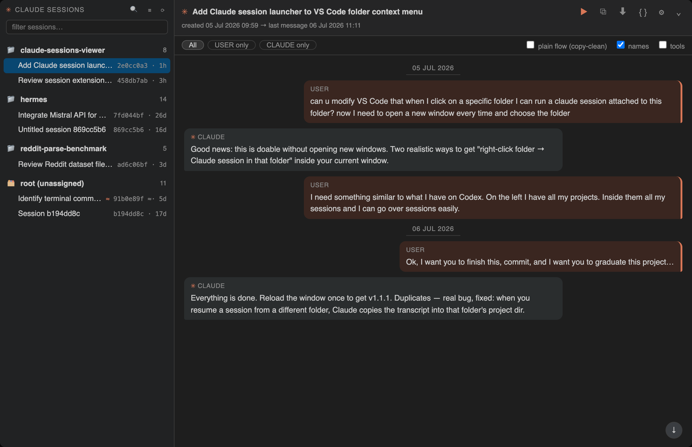
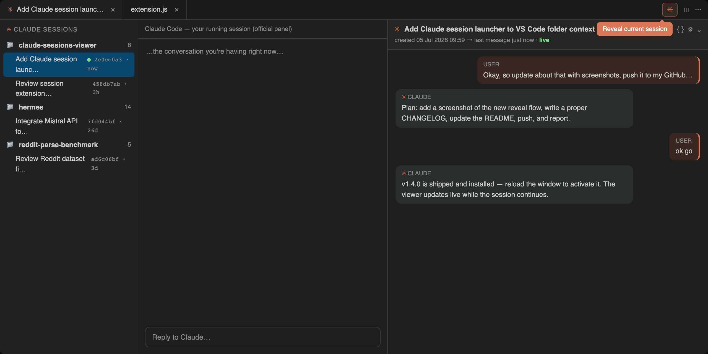
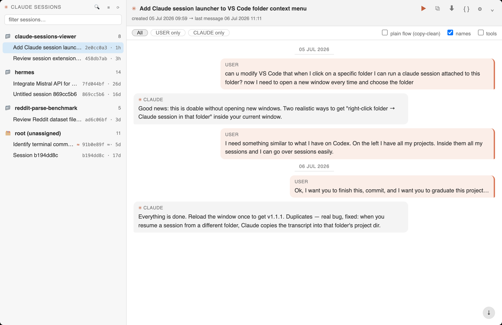
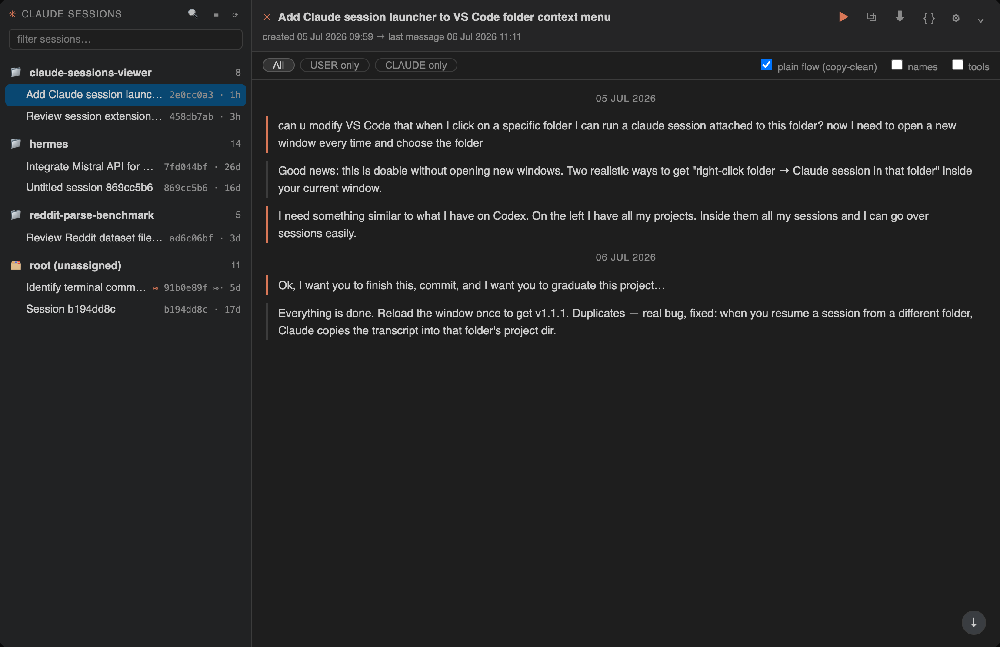
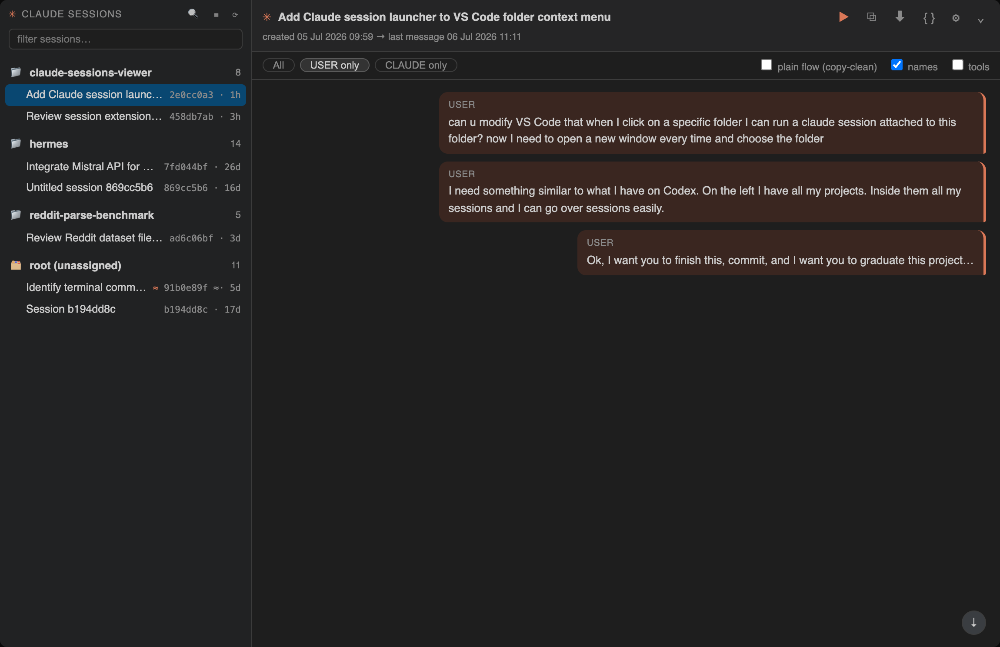

# Claude Sessions Viewer

**Read your Claude Code sessions like chat conversations: locate the one you're
in, review any of them, export. Read-only, local, zero dependencies.**



Claude Code stores every conversation on disk. This extension turns that local
history into a safe review surface inside VS Code: a project/session tree,
chat-style reading pane, current-session reveal, copy-clean export, and explicit
resume buttons. It reads `~/.claude`; it does not edit or delete transcripts.

## Features

- **Folder-first session tree** — folders A-Z, with each folder's sessions
  newest first. Visible `[age]` labels show when each row was last updated.
  The experimental flat timeline is hidden behind a setting while its layout is
  being redesigned.
- **Working-folder grouping** — sessions are grouped by the real folder they
  ran in (the transcript's recorded `cwd`). No current-workspace guessing and
  no content-based re-filing.
- **Messenger-style conversation viewer** — click a session and read it like a
  chat: your messages right with a green edge, Claude's left with a coral
  edge, names visible by default, tool noise hidden, and the viewer opens at
  the last message.
- **Fast review controls** — All / you / Claude filters, collapsible long
  messages, inside-session search, clickable links, image attachment markers,
  Markdown/code/table rendering, copy raw session path, copy conversation, and
  export to Markdown.
- **Launchers** — right-click any folder in the Explorer: *New session
  here* (terminal) or *New window session here* (official Claude Code
  panel). Resume stays explicit inside the review pane.
- **Reveal current session** — a ✳ button on the Claude Code panel tab (and
  in the status bar) locates the session you're working in right now:
  highlights it in the tree. New users can also open the conversation review
  pane automatically; constant users can switch that off.
- **Rename** — give untitled sessions a custom name (stored locally).
- **Session-level first** — the tree defaults to collapsed folders and
  folder → session browsing. Prompt rows under sessions can be switched on in
  settings when needed.

**Reveal the session you're in right now** — ✳ on the panel tab → highlighted in the tree:



| Light theme | Messenger review | Filter: your messages |
| --- | --- | --- |
|  |  |  |

## How it works

- **Where sessions come from.** Claude Code writes every conversation to a
  transcript file under `~/.claude/projects/`. The extension reads those
  files — it never runs Claude, never phones home, and needs no configuration.
- **How grouping works.** Each transcript records the folder the session was
  started in. Folder mode sorts those folders A-Z and keeps each folder's
  sessions newest first. The experimental Session Timeline, when enabled,
  lists sessions as a flat newest-first history across folders.
  A folder marked `gone` no longer exists on disk — its sessions are kept as
  browsable history.
- **When the list updates.** There is no background watcher. The tree
  re-indexes when the panel is opened or becomes visible again, when you
  press the ↻ refresh button, and when you press reveal (✳). So a session
  started in a new folder shows up the next time any of those happen.
  Re-indexing is cheap: only changed transcripts are re-read.
- **Conversations are always fresh.** Opening a session reads its transcript
  from disk at that moment, and the review pane live-updates while the
  session keeps writing.

## Security & privacy — a viewer, not a manager

Your Claude Code sessions are private data: months of your prompts, your
code, your thinking. Pointing any extension at them is an act of trust, so
this project is built around one rule and makes it checkable rather than
asking you to believe it:

**This extension never writes inside `~/.claude`. It only reads.**

- **Machine-checked, not promised.** The test suite patches every mutating
  filesystem API, runs the full indexing and viewing pipeline, and fails CI
  if anything ever writes inside `~/.claude` — it also verifies transcript
  bytes are untouched. Every push runs it.
- **Everything it does write, listed.** Its own index cache and window notes
  go to VS Code's extension storage; your custom session titles go to VS Code
  settings storage; Markdown exports go to a file *you* pick in a save
  dialog. That is the complete list.
- **No network, no telemetry.** There is not a single network call in the
  code. The viewer's webview runs under a `default-src 'none'` content
  security policy, so even the page rendering your conversations has no way
  to load or send anything.
- **Auditable in minutes.** Zero dependencies, four plain unminified
  JavaScript files — the package you install is the source you can read.
  One search over the code confirms every claim above.
- **One explicit action boundary.** The only thing that can ever change a
  session is Claude Code itself, when *you* press resume — and that runs the
  official `claude` CLI in a terminal you can see. Session ids are validated
  as strict UUIDs before they touch a command line.

Some choices explained, because they were deliberate:

- **Custom titles live in VS Code storage, not in your transcripts.** Writing
  titles into the `.jsonl` files would make them portable — and would mean
  modifying Anthropic's session files, risking a broken resume. Not worth it.
- **There is no delete, cleanup, or bulk management.** Managing sessions
  means write access to your history; one bug away from destroying it. This
  extension stays a viewer so that it structurally *cannot* be that bug.
- **There is no "skip permissions" resume.** Convenience isn't worth
  normalizing a dangerous flag.

## Install

Grab the `.vsix` from [Releases](https://github.com/yurykoretskiy/claude-sessions-viewer/releases), then:

```bash
code --install-extension claude-sessions-viewer-<version>.vsix
```

Reload the window. A ✳ icon appears in the activity bar.

Or build from source (no toolchain needed — plain JavaScript):

```bash
git clone https://github.com/yurykoretskiy/claude-sessions-viewer
cd claude-sessions-viewer && ./build-vsix.sh --install
```

## First run

On activation the extension indexes `~/.claude/projects` (your existing
Claude Code sessions — nothing to configure). Indexing streams each
transcript once and caches results, so the first load takes a few seconds
per few hundred sessions and is instant afterwards; only changed files are
re-read. The tree refreshes when the panel opens or becomes visible, when you
press ⟳, or when you reveal the current session.
Conversations are parsed lazily — only when you open one. On a cold first
run, the tree shows an indexing row immediately instead of staying blank.
Prompt/message preview rows under sessions are off by default for faster
session-level browsing.

## Settings

- `claudeSessionsViewer.reveal.enabled` — show/enable reveal controls.
- `claudeSessionsViewer.reveal.openConversation` — reveal also opens the
  read-only conversation viewer. On by default for new users; switch it off
  for tree-only reveal.
- `claudeSessionsViewer.liveRefresh.enabled` — keep an opened viewer updated
  while the transcript changes. Off by default.
- Speaker names, labels, and visibility are controlled from the viewer's `⋯`
  menu and stay with the viewer experience rather than the global Settings
  page.
- `claudeSessionsViewer.messageFooter.enabled` — optionally show a compact
  copyable footer inside each message. Its avatar, role, model, and time parts
  can be toggled independently with the related `messageFooter` settings.
- `claudeSessionsViewer.promptChildren.enabled` — show prompt/message rows
  under sessions. Off by default.
- `claudeSessionsViewer.timeline.enabled` — show the experimental flat session
  timeline toggle. Off by default until the layout is clearer.

## Privacy & how it works

Everything is local. The extension reads Claude Code's own session files
(`~/.claude/projects/*/*.jsonl`), writes nothing to them, and makes no
network requests of any kind. No telemetry.

Tip: Claude Code deletes transcripts after 30 days by default. Add
`"cleanupPeriodDays": 365` to `~/.claude/settings.json` to keep a year.

## Requirements

- VS Code ≥ 1.85
- [Claude Code](https://claude.com/claude-code) CLI (`claude`) on PATH —
  only needed for the resume/new-session buttons; browsing works without it
- macOS/Linux

## For AI agents

Working on this repo with Claude Code, Codex, or similar? Read
[AGENTS.md](AGENTS.md) — file map, build/deploy contract, and the invariants
that must not be broken. Deferred ideas live in [BACKLOG.md](BACKLOG.md);
maintainer's working notes in `docs/`, `findings/`, `inputs/`, `handoffs/`.

## Changelog

Version history in [CHANGELOG.md](CHANGELOG.md); every release ships an
installable `.vsix` on the [Releases page](https://github.com/yurykoretskiy/claude-sessions-viewer/releases).

## License

[MIT](LICENSE)
